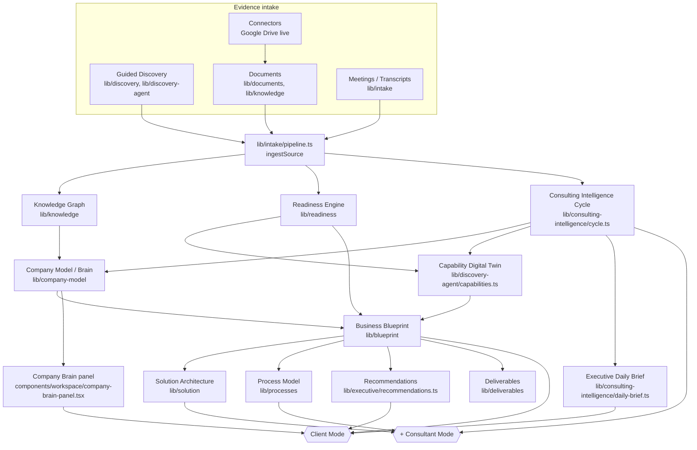
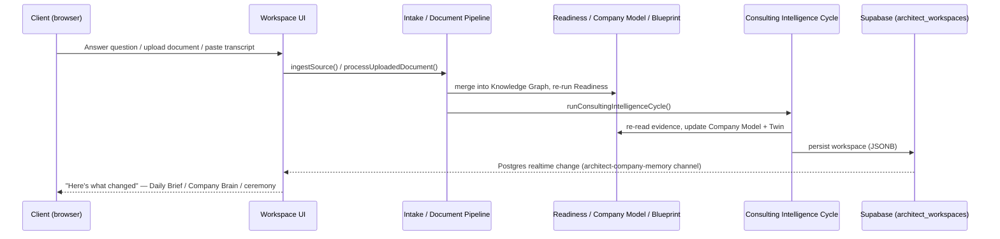

# 01 — Architect Context

**Read this first.** This is the fast path into what Architect *is*, for any agent (or human)
starting a session on `apps/architect`.

**Extends, does not replace:** [`docs/PRODUCT_CONSTITUTION.md`](../../../../docs/PRODUCT_CONSTITUTION.md)
(the permanent, binding north star for `apps/architect`) and
[`apps/architect/PRODUCT_PRINCIPLES.md`](../../PRODUCT_PRINCIPLES.md) (the canonical, do-not-remove
product principles file). Where this document and those disagree, those two win — file an issue,
don't silently pick one. This document's job is to be a faster, more concrete on-ramp into the same
truth, plus the "how do the systems connect" picture those documents deliberately leave out.

Also extends [`docs/architecture/AI_CONSTITUTION.md`](../../../../docs/architecture/AI_CONSTITUTION.md)
(monorepo-wide engineering law — reuse before creating, extend before replacing, one visual
language, small PRs) as it applies to Architect's own local component library.

---

## What Architect IS

Architect is a **consulting-intelligence platform** that sits with a company *before* a line of
production software gets written. It interviews, listens, reads documents and meetings, and builds
**one evolving, evidence-derived Business Blueprint** per company — then derives Solution
Architecture, Process Models, Recommendations, and Deliverables from that single source of truth.

Tagline (the test every feature must pass):

> **"Architect becomes more intelligent every time your company shares knowledge."**

Every future screen, panel, or deliverable must be traceable to one of the **three permanent
client questions**:

1. **What do we know?** — evidence gathered so far.
2. **What are we trying to learn?** — open questions, gaps, next-highest-value inquiry.
3. **Why does it matter?** — the business consequence: risk, opportunity, cost of not knowing.

A screen that shows data without answering one of these three is decoration, not consulting.

## What Architect is NOT

- Not a chatbot, not a CRM, not a workflow editor / no-code builder.
- Not a generic AI assistant, ticket tracker, BI tool, or document dump with AI sprinkled on top.
- Not a place to "generate apps" before understanding the company.
- Not an ERP/Slack/ChatGPT clone.

If a feature would make Architect feel like any of the above, it does not belong — regardless of
how impressive it is in isolation. Full detail: `docs/PRODUCT_CONSTITUTION.md` §"What Architect IS
/ IS NOT".

## Client vs. Consultant — the hard boundary

Architect has exactly one shared workspace model per company, viewed through two lenses:

| | **Client** (`role: "client"`) | **Consultant** (`role: "consultant"`) |
| --- | --- | --- |
| Sees | Guided discovery, Dashboard, Blueprint, Recommendations, Report, Simulator, Knowledge Center, Deliverables | Everything the client sees **plus** `assessment` (Diagnóstico), `architecture` (Sistema recomendado), `processes` (Cómo opera) |
| Never sees | Internal consultant reasoning, raw engine ids, diagnostic tabs | — |
| Tone | Senior consultant speaking Spanish, plain business language | Same evidence, sharper diagnostic framing |

This is a hard boundary of **intent**, not decoration — enforced server-side (`middleware.ts`
re-derives role from the session on every request; a client-supplied role is never trusted). See
`lib/consulting-intelligence/visibility.ts` (the Consulting Intelligence Agent's client-mode gate)
and `docs/SECURITY_POSTURE.md` for the current enforcement boundary and known gaps.

The current pilot runs both roles against one shared workspace (`ws_isalwa`) — see
[`04_ARCHITECT_RECEIPT.md`](./04_ARCHITECT_RECEIPT.md).

## Core concepts

### Digital Twin

Two twin layers, deliberately distinct — neither is a second scoring model, both regroup evidence
the Readiness Engine and Company Model Engine already compute:

- **Capability Digital Twin** (`lib/discovery-agent/capabilities.ts`) — 10 durable business
  capabilities (Ventas, Finanzas, Operaciones, …), each with a confidence/readiness state derived
  from the Readiness Engine's own evidence. An unmeasured capability says "not measured," never a
  guessed number.
- **Company Model / "Company Brain"** (`lib/company-model/`) — the living operating model:
  departments, people, roles, systems, workflows, information flows, decision flows, critical
  dependencies, health — all ID-referenced back to Blueprint/Knowledge/Meetings/Consulting.

### Company Brain

The client-facing surface (`components/workspace/company-brain-panel.tsx`, composing
`lib/consulting-intelligence/company-brain.ts`) that answers "what does Architect actually know
about my company?" in plain language — the same Company Model + Knowledge evidence other tabs use,
reframed as an always-current institutional memory rather than a diagnostic. Shipped as the second
pass of Mission 21 (see the receipt).

### Discovery

The guided, adaptive interview (`components/discovery/guided/`, `lib/discovery/`,
`lib/discovery-agent/`) that asks the fewest questions that maximize information gain, grounds
every follow-up in prior evidence ("Basado en…" chips), and produces a client-facing Discovery
Complete/Incomplete ceremony — never a bare percentage — once every measured capability has enough
evidence.

### Blueprint

`lib/blueprint/` derives the versioned **Business OS Blueprint** — capabilities, departments,
workflows, entities, rules, systems — from Knowledge + Memory + Meetings + Reasoning evidence.
Append-only versions; nothing is overwritten. This is the **one** canonical source of truth every
other output (Solution Architecture, Process Model, Deliverables, future ISALWA OS configuration)
derives from.

### Recommendations

`lib/executive/recommendations.ts` and `components/workspace/executive/explained-recommendation-card.tsx`
turn evidence + readiness gaps into ranked, explained recommendations — every recommendation
carries its evidence and its confidence; nothing is shown that can't be traced back to a source.

### Knowledge

`lib/knowledge/` is the evidence vault — documents, meetings, connectors (Google Drive live;
SharePoint/QuickBooks/HubSpot scaffolded honestly, not faked) all merge into one knowledge graph via
`lib/intake/pipeline.ts`. Every upload runs the same ten-stage pipeline
(`lib/documents/pipeline.ts`): OCR → extract → chunk → embed → detect → knowledge graph → vectors →
readiness → insights → recommendations.

### Consulting Intelligence

`lib/consulting-intelligence/cycle.ts` (`runConsultingIntelligenceCycle`) is a background,
**non-conversational** loop that re-reads what the engines already say after every new piece of
evidence (interview answer, document, meeting transcript) and writes a private notebook
(`workspace.consultingIntelligence`) — it re-reads, it never re-scores, and it is never exposed to
Client Mode.

### Executive Daily Brief

`lib/consulting-intelligence/daily-brief.ts` +
`components/workspace/executive/executive-daily-brief.tsx` — replaces a generic dashboard hero with
a senior-consultant-style brief that answers, without a click: "where are we," "what changed since
my last visit," "what should I do next" — composed entirely from existing engine outputs plus real
timeline/meeting/document evidence (Mission 20, Part 2).

### Living Company Intelligence

The umbrella idea behind Company Brain, the Daily Brief, and the "what changed" document/meeting
debriefs (Missions 20–22): the product never silently updates numbers in the background. Every
material change to what Architect knows is spoken back to the client in one honest, evidence-sourced
consulting sentence — not a toast, not a fabricated milestone.

## How the systems connect

Every arrow above is a **read**, not a rewrite: each engine composes the previous one's output. No
box in this diagram invents a second scoring model, a second source of truth, or a parallel data
store. See [`03_ARCHITECT_ARCHITECTURE.md`](./03_ARCHITECT_ARCHITECTURE.md) for real file paths and
lifecycle detail.

## Where to go next

- Permanent engineering rules → [`02_ARCHITECT_CONSTITUTION.md`](./02_ARCHITECT_CONSTITUTION.md)
- Real folders, engines, data flows → [`03_ARCHITECT_ARCHITECTURE.md`](./03_ARCHITECT_ARCHITECTURE.md)
- What's shipped, current phase, known WIP → [`04_ARCHITECT_RECEIPT.md`](./04_ARCHITECT_RECEIPT.md)
- Starting a new mission → [`05_MISSION_TEMPLATE.md`](./05_MISSION_TEMPLATE.md)
