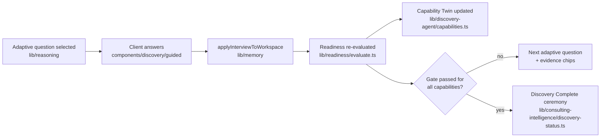
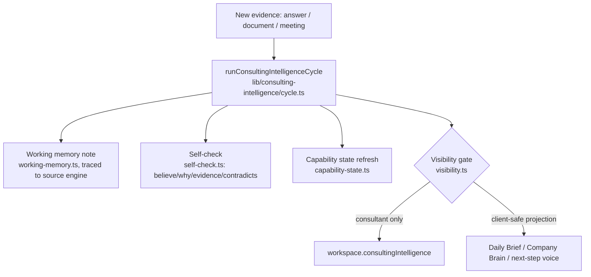
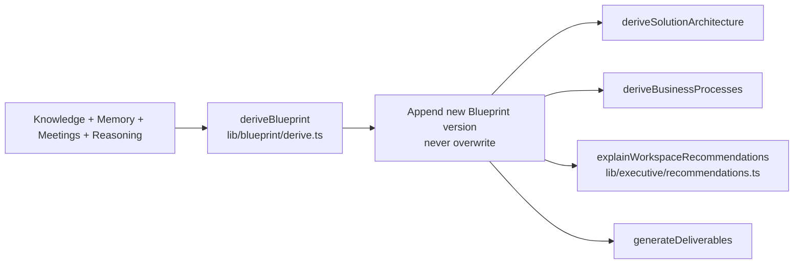

# 03 — Architect Architecture

Real folders, engines, and data flows as they exist in the code today. Cites actual paths under
`apps/architect/lib/` and `apps/architect/components/` — if a path below goes stale, fix this doc
in the same PR that moves the code.

For the historical "why this shape" narrative per mission, see `apps/architect/ARCHITECTURE.md`
(unchanged, kept as the mission-by-mission architecture log) — this document is the current-state
map an agent should read first.

## Top-level layout

```text
apps/architect/
  app/                       Next.js App Router
    api/                     auth, connectors, documents, interview routes
    workspace/[id]/          the main authenticated surface
    discovery/ · login/ · preparation/ · report/ · companies/
  components/
    workspace/               tabs, panels (blueprint, solution, processes, deliverables, brand,
                              company model, company brain, knowledge, connectors, roadmap)
      executive/              dashboard, daily brief, twin panel, ceremony cards, recommendation
                               cards, triad briefing, confidence meter, guided journey
    discovery/guided/         the guided interview shell + evidence chips + adaptive follow-ups
    home/ · nav/ · auth/ · preparation/ · report/ · landing/ · shared/ · ui/
  lib/
    discovery/                answer/question plumbing for the guided interview
    discovery-agent/          Capability Digital Twin (capabilities.ts)
    reasoning/                the adaptive interview "brain" (unchanged since Mission 2)
    readiness/                Readiness Engine — evaluate/gate/missing-information/planner
    consulting-intelligence/  the non-conversational re-read loop + Company Brain + Daily Brief
    company-model/            departments/people/systems/workflows/relationships/health
    knowledge/                vault, pipeline, coverage, briefing, connectors
    intake/                   detectors, extractors, sources — the shared ingestion path
    documents/                upload, OCR, extraction, chunking, embeddings, vectors, pipeline
    ai/                       provider abstraction (Gemini/OpenAI/Anthropic) + retrieval
    blueprint/                Business OS Blueprint — derive/version/future-outputs
    solution/                 Solution Architecture (deterministic)
    processes/                Business Process Model (deterministic)
    process-visualization/    Process Studio presentation layer
    deliverables/             consulting package builders
    executive/                dashboard/alerts/recommendations/daily-summary projections
    industry-intelligence/    playbooks + priority-only bias
    history/ · insights/ · preparation/ · simulation/ · explanations/
    brand/                    Brand & Experience Studio
    auth/                     session, roles, Supabase + pilot cookie fallback
    connectors/                connector catalog + OAuth (Google Drive live)
    repositories/ · persistence/ · workspace/ · cache/ · search/ · timeline/ · reports/ · resume/
    business-builder/ · implementation-package/
  supabase/                  migrations, OPERATOR_GUIDE.md
  types/                     domain contracts (workspace.ts is the big one)
```

## Engine map (what each `lib/` module owns)

| Module | Owns | Consumes |
| --- | --- | --- |
| `lib/reasoning/` | Adaptive interview brain, next-question selection | — (foundational) |
| `lib/discovery/`, `lib/discovery-agent/` | Guided interview stages, Capability Digital Twin | `lib/readiness/` |
| `lib/readiness/` | Readiness score, gate, missing-information ranking, explainable confidence | Interview answers, Knowledge |
| `lib/intake/` | Shared detectors/extractors/sources for any evidence type (answer, document, transcript) | — |
| `lib/documents/` | Upload → OCR → extract → chunk → embed → vectors, the ten-stage pipeline | `lib/intake/` |
| `lib/knowledge/` | Knowledge graph, vault, coverage, connectors catalog | `lib/intake/`, `lib/documents/` |
| `lib/ai/` | Provider abstraction (`ai.chat/embed/summarize`), Retrieval (`RetrievalPack`) | Config (`ARCHITECT_LLM_*`) |
| `lib/consulting-intelligence/` | Re-read cycle, working memory, self-check, visibility gate, Company Brain, Daily Brief, next-step voice, discovery-status ceremony | Readiness, Knowledge, Company Model |
| `lib/company-model/` | Departments, people, systems, workflows, relationships, health, dependencies | Blueprint, Knowledge, Consulting |
| `lib/blueprint/` | Versioned Business OS Blueprint (canonical source of truth) | Knowledge, Memory, Meetings, Reasoning |
| `lib/solution/`, `lib/processes/`, `lib/process-visualization/` | Deterministic derived models — never invent, never LLM-layout | Blueprint |
| `lib/deliverables/` | Consulting package builders (exec summary, PRD, roadmap, …) | Memory, Blueprint, Solution, Processes, Consulting |
| `lib/executive/` | Dashboard/alert/recommendation/daily-summary *projections* — presentation only, no new engines | All of the above |
| `lib/industry-intelligence/` | Curated playbooks, priority-only bias re-weighting | Readiness question/gap priority |
| `lib/auth/` | Session, roles, capability matrix, Supabase + pilot fallback | — |
| `lib/connectors/` | OAuth + sync (Google Drive live; others scaffolded honestly) | feeds `lib/documents/` |

## Lifecycles

### Discovery / guided interview lifecycle



### Document lifecycle

```mermaid
flowchart LR
    UP[Upload / Drive import] --> STORE[Supabase Storage\nlib/documents/storage.ts]
    STORE --> PIPE[processUploadedDocument\nlib/documents/pipeline.ts]
    PIPE --> OCR[OCR\nlib/documents/ocr.ts] --> EXT[Extract\nextraction.ts]
    EXT --> CHUNK[Chunk\nchunking.ts] --> EMB[Embed\nembeddings.ts]
    EMB --> VEC[Vectors\nvectors.ts]
    EXT --> DET[Detectors\nlib/intake]
    DET --> KG[Knowledge Graph\nlib/knowledge]
    KG --> CIC[Consulting Intelligence Cycle]
    CIC --> SUM[Batch change summary\nlib/documents/change-summary.ts]
    SUM --> CLIENT[Client sees: "here's what we now understand"]
```

### Meeting lifecycle

Meetings/transcripts are first-class evidence, sharing the **same** path as documents from
`lib/intake/pipeline.ts` onward (Mission 22): paste/upload transcript → `ingestSource()` with
`meeting_transcript` source type → same twelve detectors (`lib/intake/extractors.ts`) → same
Consulting Intelligence Cycle → the same batch "what changed" debrief pattern
(`lib/documents/change-summary.ts`) reused verbatim, rendered via
`components/workspace/preparation-brief-panel.tsx`.

### Consulting cycle (background re-read loop)



### Blueprint / recommendations lifecycle



### Retrieval (RetrievalPack)

`lib/ai/retrieval/pack.ts` builds a bounded, provenance-tagged context pack (recent answers,
document chunks, knowledge entities, readiness gaps) for two call sites: the Consulting
Intelligence cycle, and the guided-discovery "Basado en…" evidence chips
(`components/discovery/guided/evidence-chips.tsx`). `buildRetrievalPackSync()` (keyword-ranked) is
what actually runs today; `buildRetrievalPack()` (real embeddings, async) exists but has no wired
call site yet — see [`04_ARCHITECT_RECEIPT.md`](./04_ARCHITECT_RECEIPT.md) known gaps.

### Daily Brief

`lib/consulting-intelligence/daily-brief.ts` composes the Readiness Assessment, Missing
Information Report, Blueprint Readiness Gate, and Discovery Completion status into one senior-
consultant-style brief, rendered by
`components/workspace/executive/executive-daily-brief.tsx` as the Executive tab's hero (replacing
the old generic `WelcomeBanner`).

### Company Brain

`lib/consulting-intelligence/company-brain.ts` reframes the Company Model
(`lib/company-model/derive.ts`) as a plain-language "what Architect knows about your company" feed,
rendered by `components/workspace/company-brain-panel.tsx`.

## Auth / route protection

`middleware.ts` protects every non-public route and re-derives the role server-side on every
request (`lib/auth/session.ts` → `getServerSession()`), never trusting a client-supplied role.
Supabase Auth is primary; a pilot cookie session is the fallback when Supabase env vars are absent
(see `docs/SECURITY_POSTURE.md` for the known risk this implies). Realtime sync between Client and
Consultant views of the same workspace runs over the `architect-company-memory` Postgres changes
channel on `architect_workspaces`.

## Where to go next

- Product intent behind these systems → [`01_ARCHITECT_CONTEXT.md`](./01_ARCHITECT_CONTEXT.md)
- Rules that protect these systems → [`02_ARCHITECT_CONSTITUTION.md`](./02_ARCHITECT_CONSTITUTION.md)
- What's shipped on top of this architecture → [`04_ARCHITECT_RECEIPT.md`](./04_ARCHITECT_RECEIPT.md)
